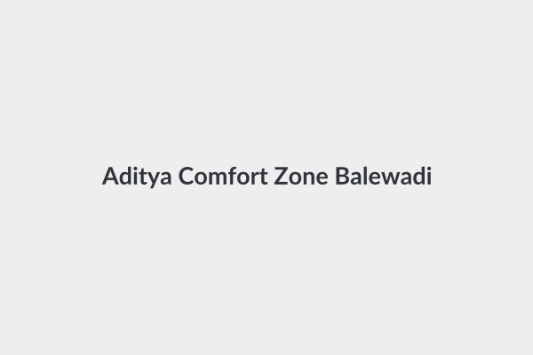
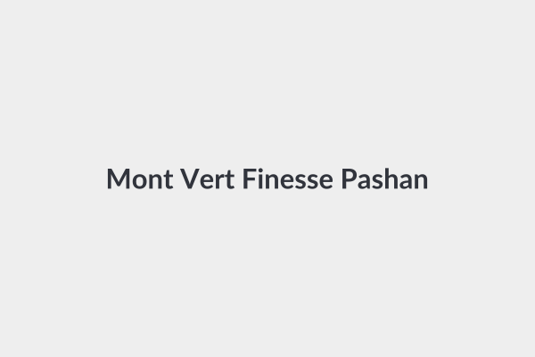
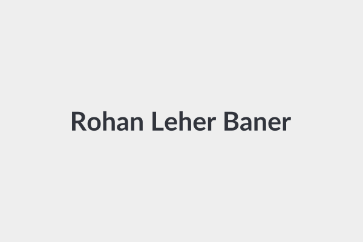
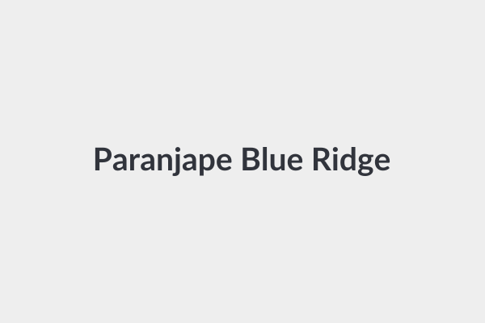
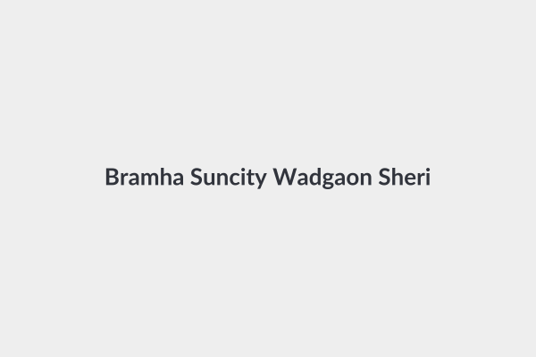

# Shortlisted 3 BHK Societies in Pune (Budget: < ₹40,000 / month)

This document curates the top residential societies across Pune with verified direct inspection links, expected rents, maintenance fees, power backup details, and society highlights.

---

## 1. West Pune: Baner, Balewadi & Mahalunge

| Society Name | Micro-Location | Typ. 3 BHK Rent (Semi / Full) | Society Maintenance | Power Backup | Direct Inspection & Listing Links |
| :--- | :--- | :--- | :--- | :--- | :--- |
| **Aditya Comfort Zone** | Balewadi | Semi: **₹38k–₹44k** Full: **₹48k–₹55k** | ~₹3,200/mo (Clarify if incl.) | 100% DG (Common) + Inverter |  | • [NoBroker Aditya Comfort Zone](https://www.nobroker.in/flats-for-rent-in-balewadi_pune) • [99acres Comfort Zone](https://www.99acres.com/flats-for-rent-in-balewadi-pune-ffid) • [Housing.com Comfort Zone](https://housing.com/in/rent/pune) |
| **Natu Golden Trellis** | Balewadi (Near High St) | Semi: **₹38k–₹43k** Full: **₹46k–₹52k** | ~₹3,000/mo | DG Backup (Lifts & Common) | • [NoBroker Balewadi Rentals](https://www.nobroker.in/flats-for-rent-in-balewadi_pune) • [99acres Golden Trellis](https://www.99acres.com/flats-for-rent-in-balewadi-pune-ffid) • [Magicbricks Balewadi](https://www.magicbricks.com/property-for-rent/residential-real-estate?profilename=Balewadi&cityName=Pune) |
| **Mont Vert Finesse / Biarritz** | Baner-Pashan Link Rd | Semi: **₹38k–₹44k** Full: **₹48k–₹54k** | ~₹3,500/mo | Full DG Backup |  | • [NoBroker Mont Vert Finesse](https://www.nobroker.in/property/rent/pune/Mont-Vert-Finesse_Pashan/t-search) • [99acres Mont Vert Finesse](https://www.99acres.com/flats-for-rent-in-pashan-pune-ffid) • [Magicbricks Mont Vert](https://www.magicbricks.com/property-for-rent/residential-real-estate?profilename=Mont-Vert-Finesse&cityName=Pune) |
| **Rohan Leher (I & II)** | Baner-Pashan Link Rd | Semi: **₹40k–₹45k** Full: **₹50k–₹56k** | ~₹4,000/mo | Full DG Backup |  | • [NoBroker Rohan Leher](https://www.nobroker.in/property/rent/pune/Rohan-Leher_Baner/t-search) • [99acres Rohan Leher](https://www.99acres.com/flats-for-rent-in-baner-pune-ffid) • [Magicbricks Rohan Leher](https://www.magicbricks.com/property-for-rent/residential-real-estate?profilename=Rohan-Leher&cityName=Pune) |
| **Paranjape Rolling Hills** | Baner-Pashan Link Rd | Semi: **₹38k–₹44k** Full: **₹46k–₹52k** | ~₹3,500/mo | Full DG Backup | • [NoBroker Baner Rentals](https://www.nobroker.in/flats-for-rent-in-baner_pune) • [99acres Rolling Hills Baner](https://www.99acres.com/flats-for-rent-in-baner-pune-ffid) • [Housing Baner Link Rd](https://housing.com/in/rent/pune) |
| **Godrej Hillside / Green Cove** | Mahalunge (Baner Annexe) | Semi: **₹30k–₹35k** Full: **₹36k–₹42k** | ~₹2,500/mo (Included in most) | 100% DG Backup (Flat + Common) | • [NoBroker Mahalunge Listings](https://www.nobroker.in/flats-for-rent-in-mahalunge_pune) • [99acres Godrej Hillside](https://www.99acres.com/flats-for-rent-in-mahalunge-pune-ffid) • [Magicbricks Godrej Hillside](https://www.magicbricks.com/property-for-rent/residential-real-estate?profilename=Mahalunge&cityName=Pune) |
| **VTP Alpine / Leonara / Bel Air** | Mahalunge (Codename Blueair)| Semi: **₹30k–₹35k** Full: **₹35k–₹40k** | ~₹2,500/mo | 100% DG Backup | • [NoBroker VTP Alpine](https://www.nobroker.in/flats-for-rent-in-mahalunge_pune) • [99acres VTP Alpine](https://www.99acres.com/flats-for-rent-in-mahalunge-pune-ffid) • [Magicbricks VTP Leonara](https://www.magicbricks.com/property-for-rent/residential-real-estate?profilename=Mahalunge&cityName=Pune) |
| **Puraniks Aldea Espanola** | Mahalunge / Baner Edge | Semi: **₹32k–₹38k** Full: **₹40k–₹45k** | ~₹3,000/mo | Full DG Backup | • [NoBroker Mahalunge](https://www.nobroker.in/flats-for-rent-in-mahalunge_pune) • [99acres Aldea Espanola](https://www.99acres.com/flats-for-rent-in-mahalunge-pune-ffid) • [Housing Aldea Espanola](https://housing.com/in/rent/pune) |

---

## 2. West Pune: Wakad & Hinjewadi (Phase 1, 2, 3)

| Society Name | Micro-Location | Typ. 3 BHK Rent (Semi / Full) | Society Maintenance | Power Backup | Direct Inspection & Listing Links |
| :--- | :--- | :--- | :--- | :--- | :--- |
| **Paranjape Blue Ridge** *(Top Pick)* | Hinjewadi Phase 1 | Semi: **₹35k–₹42k** Full: **₹40k–₹46k** | ~₹3,500/mo (Often incl.) | 100% Full DG |  | • [NoBroker Paranjape Blue Ridge](https://www.nobroker.in/property/rent/pune/Hinjewadi/Paranjape-Blue-Ridge) • [99acres Blue Ridge 3BHK](https://www.99acres.com/flats-for-rent-in-hinjewadi-pune-ffid) • [Magicbricks Blue Ridge](https://www.magicbricks.com/property-for-rent/residential-real-estate?cityName=Pune) |
| **Kolte Patil Life Republic** *(Top Furnished Value)* | Marunji / Hinjewadi Link Rd | Semi: **₹26k–₹32k** Full: **₹32k–₹38k** | ~₹2,800/mo | 100% Full DG |  | • [NoBroker Life Republic](https://www.nobroker.in/flats-for-rent-in-hinjewadi_pune) • [99acres Life Republic 3BHK](https://www.99acres.com/flats-for-rent-in-hinjewadi-pune-ffid) • [Magicbricks Life Republic](https://www.magicbricks.com/property-for-rent/residential-real-estate?cityName=Pune) |
| **Rohan Tarang** | Kaspate Wasti, Wakad | Semi: **₹32k–₹38k** Full: **₹38k–₹44k** | ~₹3,000/mo | 100% Full DG |  | • [NoBroker Wakad Flats](https://www.nobroker.in/flats-for-rent-in-wakad_pune) • [99acres Rohan Tarang](https://www.99acres.com/flats-for-rent-in-wakad-pune-ffid) • [Magicbricks Rohan Tarang](https://www.magicbricks.com/property-for-rent/residential-real-estate?profilename=Wakad&cityName=Pune) |
| **Costa Rica (Rama Group)** | Kaspate Wasti, Wakad | Semi: **₹34k–₹40k** Full: **₹42k–₹48k** | ~₹3,200/mo | Full DG Backup | • [NoBroker Wakad](https://www.nobroker.in/flats-for-rent-in-wakad_pune) • [99acres Costa Rica Wakad](https://www.99acres.com/flats-for-rent-in-wakad-pune-ffid) • [Housing Costa Rica](https://housing.com/in/rent/pune) |
| **Megapolis Township** | Hinjewadi Phase 3 | Semi: **₹25k–₹32k** Full: **₹30k–₹36k** | ~₹2,500/mo | 100% Full DG |  | • [NoBroker Megapolis Hinjewadi](https://www.nobroker.in/flats-for-rent-in-hinjewadi_pune) • [99acres Megapolis Hinjewadi](https://www.99acres.com/flats-for-rent-in-hinjewadi-pune-ffid) • [Magicbricks Megapolis](https://www.magicbricks.com/property-for-rent/residential-real-estate?profilename=Megapolis&cityName=Pune) |
| **Sonigara Signature Park** | Wakad / Thergaon | Semi: **₹30k–₹36k** Full: **₹36k–₹42k** | ~₹2,600/mo | DG Backup | • [NoBroker Wakad](https://www.nobroker.in/flats-for-rent-in-wakad_pune) • [99acres Signature Park](https://www.99acres.com/flats-for-rent-in-wakad-pune-ffid) • [Magicbricks Signature Park](https://www.magicbricks.com/property-for-rent/residential-real-estate?profilename=Wakad&cityName=Pune) |

---

## 3. East Pune: Kharadi & Viman Nagar

| Society Name | Micro-Location | Typ. 3 BHK Rent (Semi / Full) | Society Maintenance | Power Backup | Direct Inspection & Listing Links |
| :--- | :--- | :--- | :--- | :--- | :--- |
| **VJ Yashwin Enchante / Supernova** | Upper Kharadi | Semi: **₹32k–₹38k** Full: **₹40k–₹44k** | ~₹3,000/mo | 100% Full DG | • [NoBroker Kharadi Rentals](https://www.nobroker.in/flats-for-rent-in-kharadi_pune) • [99acres Yashwin Kharadi](https://www.99acres.com/flats-for-rent-in-kharadi-pune-ffid) • [Magicbricks Yashwin](https://www.magicbricks.com/property-for-rent/residential-real-estate?profilename=Kharadi&cityName=Pune) |
| **Godrej Parkridge / Infinity** | Manjari-Kharadi | Semi: **₹30k–₹36k** Full: **₹38k–₹44k** | ~₹2,800/mo | Full DG Backup | • [NoBroker Kharadi](https://www.nobroker.in/flats-for-rent-in-kharadi_pune) • [99acres Godrej Infinity](https://www.99acres.com/flats-for-rent-in-kharadi-pune-ffid) • [Housing Godrej Parkridge](https://housing.com/in/rent/pune) |
| **Kohinoor Zen Estate** | Kharadi Riverfront | Semi: **₹36k–₹42k** Full: **₹44k–₹50k** | ~₹3,500/mo | Full DG Backup | • [NoBroker Kharadi](https://www.nobroker.in/flats-for-rent-in-kharadi_pune) • [99acres Zen Estate](https://www.99acres.com/flats-for-rent-in-kharadi-pune-ffid) • [Magicbricks Zen Estate](https://www.magicbricks.com/property-for-rent/residential-real-estate?profilename=Kharadi&cityName=Pune) |
| **Bramha Suncity** | Wadgaon Sheri / Kalyani Nagar | Semi: **₹38k–₹44k** Full: **₹46k–₹55k** | ~₹3,800/mo | Full DG Backup |  | • [NoBroker Wadgaon Sheri](https://www.nobroker.in/flats-for-rent-in-wadgaon-sheri_pune) • [99acres Bramha Suncity](https://www.99acres.com/flats-for-rent-in-wadgaon-sheri-pune-ffid) • [Magicbricks Bramha Suncity](https://www.magicbricks.com/property-for-rent/residential-real-estate?profilename=Bramha-Suncity&cityName=Pune) |

---

## 🔑 Key Pune Rental Terms & Verification Guide
1. **Security Deposit**: Negotiate to standard **2 to 3 months of rent** in Pune.
2. **Maintenance Charges**: Always verify whether the listed rent includes society maintenance or if maintenance (₹2,500–₹4,000) is paid separately.
3. **Internal Power Backup**: Confirm whether the DG powers individual ceiling fans/lights or only common areas.
